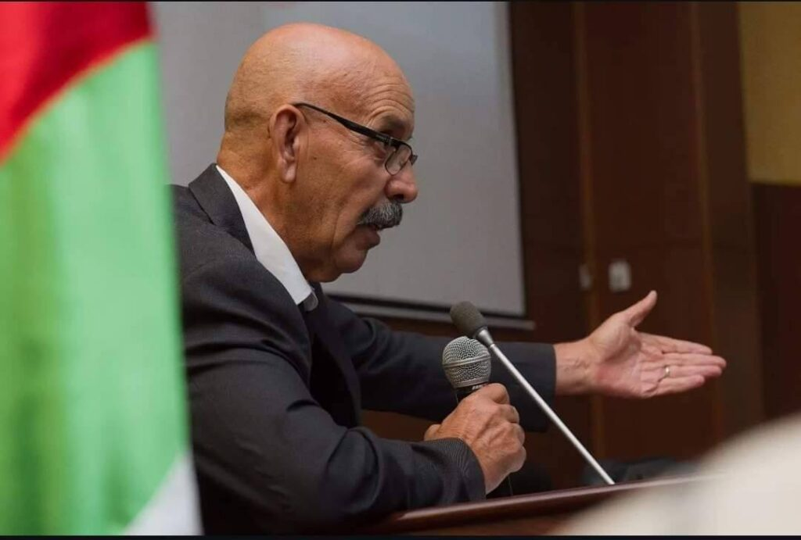
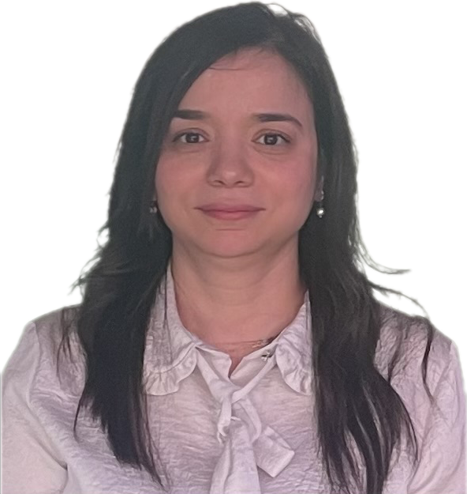
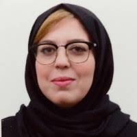

The success of the **1st Hybrid National Seminar on Bioactive Molecules (NSBM 2026)** relies on the dedication and expertise of its organizing and scientific committees. Their commitment ensures the scientific quality, organization, and success of the seminar.

---

# Honorary Chairman

:::: {.columns align="center"}

::: {.column width="25%"}

::: {.chair-photo}
{fig-alt="Prof. KHELIFI Douadi"}
:::

:::

::: {.column width="75%"}

### **Prof. KHELIFI Douadi**

**Honorary Chairman**

National Higher School of Biotechnology (ENSB), Constantine, Algeria

:::

::::

---

# Seminar Chairman

:::: {.columns align="center"}

::: {.column width="25%"}

::: {.chair-photo}
{fig-alt="Prof. MARIR Rafik"}
:::

:::

::: {.column width="75%"}

### **Prof. MARIR Rafik**

**Seminar Chairman**

National Higher School of Biotechnology (ENSB), Constantine, Algeria

:::

::::

---

# Organizing Committee

## Committee Chair

:::: {.columns align="center"}

::: {.column width="25%"}

::: {.chair-photo}
{fig-alt="Dr. BENMATI Mahbouba"}
:::

:::

::: {.column width="75%"}

### **Dr. BENMATI Mahbouba**

**Committee Chair**

National Higher School of Biotechnology (ENSB), Constantine, Algeria

:::

::::

## Members

## Members

| **Member** | **Institution** |
|------------|-----------------|
| Moufida RIRA | ENSB |
| Noureddine RAHIM | ENSB |
| Imène ASSADI | ENSB |
| Tarek ALLOUI | ENSB |
| Djamila BENOUCHENNE | ENSB |
| Esma Anissa TRAD KHODJA | ENSB |
| Amel DJEHAL | ENSB |
| Sirine BIBAK | ENSB |
| Khedidja BOUMAZA | ENSB |
| Mohamed Sabri BENSAAD | University of Batna 1 |
| Amina KEMMOUCHE | ENSB |
| Taklit MADDI | ENSB |
| Maroua DOUIBI | ENSB |
| Meriem GASMI | ENSB |
| Ines LAOURARI | ENSB |
| Maria SMATI | ENSB |
| Abir ADDOUDA | ENSB |
| Nor Elhouda AZZIZI | ENSB |
| Adel KRID | University Constantine 1 |
| Mohamed Essalih BENDJRADA | ENSB |
| Radia KECHID | ENSB |
| Ahlem CHELGHOUM | ENSB |
| Fatima Zohra KAHLOUCHE | ENSB |
| Maroua ZERMANE | ENSB |
| Asma CHEBAHI | ENSB |
| Basma TELAIDJIA | ENSB |
| Ghozlane BERBOUCHA | ENSB |
| Dounia GHARIANI | ENSB |
| Maroua BOUHADJAR | ENSB |
| Nada ABBAS | ENSB |
| Rania BOUKERZAZA | ENSB |
| Rayene BOUHIDEL | ENSB |
| Sara GUERAICHE | ENSB |
| Antar MOHAMED BOUCHAALA | ENSB |
| Skander DAKKICHE | ENSB |
| Sawssen KIKAYA | ENSB |
| Ramzy BOUDOUDA | ENSB |
| Amina ALOUACHE | ENSB |
---

# Scientific Committee

## Chair

:::: {.columns align="center"}

::: {.column width="25%"}

::: {.chair-photo}
{fig-alt="Prof. BELLIL Ines"}
:::

:::

::: {.column width="75%"}

### **Prof. BELLIL Ines**

**Scientific Committee Chair**

National Higher School of Biotechnology (ENSB), Constantine, Algeria

:::

::::

## Members

## Members

| **Committee Member** | **Institution** |
|----------------------|-----------------|
| Abdelhafid HAMIDECHI | University Constantine 1 |
| Naila Doria BOUCHEDJA | University Constantine 1 |
| Houssam BOULEBD | University Constantine 1 |
| Larbi REZGOUN | University Constantine 1 |
| Salah AKKAL | University Constantine 1 |
| Nawel OUTILI | University Constantine 3 |
| Ouidad BENSLAMA | University of Oum El Bouaghi |
| Borhane GRAMA | University of Oum El Bouaghi |
| Boualem HARFI | CRBt |
| Dalila NAIMI | ENSB |
| Rafik MARIR | ENSB |
| Mostafa BANI | ENSB |
| Amel DAFFRI | University Constantine 1 |
| Mohamed MERZOUG | ESSBO |
| Chawki BENSOUICI | CRBt |
| Mahbouba BENMATI | ENSB |
| Moufida RIRA | ENSB |
| Noureddine RAHIM | ENSB |
| Imène ASSADI | ENSB |
| Tarek ALLOUI | ENSB |
| Mohamed BERKANI | ENSB |
| Fateh MEROUANE | ENSB |
| Chamseddine DERABLI | ENSB |
| Soheib ZERROUKI | ENSB |
| Adel KECHKAR | ENSB |
| Sihem CHEHLATT | ENSB |

---