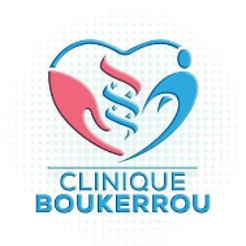
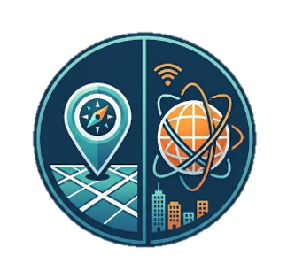
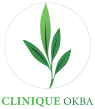
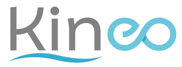
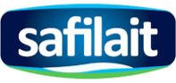
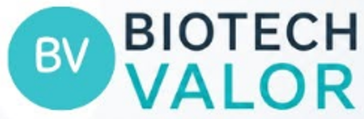
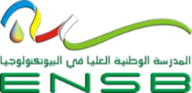
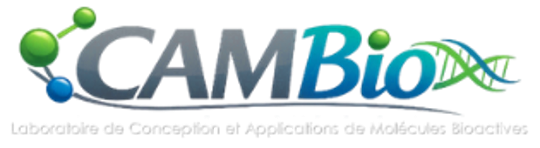

::: {.hero-banner}

{.hero-image}

:::

::: {.hero-title}

**November 29–30, 2026**

**Higher National School of Biotechnology (ENSB) – Taoufik Khaznadar Ali Mendjeli, Constantine, Algeria**

:::
::: {.hero-banner}

{.hero-image-small}

:::

The **First National Conference on Bioactive Molecules: From Characterization to Innovative Biotechnological Applications (NCBM26)** is organized by the **Conception and Application of Bioactive Molecules (CAMBio) Laboratory** in partnership with the **Higher National School of Biotechnology (ENSB)**.

Held in **hybrid format**, NCBM26 will bring together researchers, academics, doctoral students, and industry professionals to showcase the latest advances in bioactive molecules and their biotechnological applications through keynote lectures, oral and poster presentations, and high-level scientific discussions.

------------------------------------------------------------------------

## Objectives

Bioactive molecules play a central role in modern scientific innovation by connecting natural resources with solutions that improve human health, agriculture, energy production, and environmental sustainability.

The Conference aims to:

- promote the valorization of natural bioresources;
- encourage innovation in biotechnology;
- strengthen collaboration between academia and industry;
- showcase recent scientific advances;
- foster interdisciplinary research addressing national and global challenges.

------------------------------------------------------------------------

## Scientific Themes

{width="75%" fig-align="center"}

------------------------------------------------------------------------

## Important Dates

**Call for Abstracts Opens**  
July 15, 2026

**Abstract Submission Deadline**  
September 30, 2026

**Notification of Acceptance**  
October 15, 2026

**Registration Fee Payment**  
October 16–31, 2026

**Conference**  
November 29–30, 2026

------------------------------------------------------------------------

::: {.callout-important collapse="false"}
## Join us in Constantine!

Be part of the first national scientific event dedicated to bioactive molecules and innovative biotechnological applications.

**Molecules Shaping Bio-innovation**
:::

------------------------------------------------------------------------

## Sponsors & Partners

We gratefully acknowledge the generous support of our sponsors and partners, whose contributions make **NCBM 2026** possible.

::: {.columns}

::: {.column width="25%"}
{fig-align="center" width="85%"}
:::

::: {.column width="25%"}
{fig-align="center" width="85%"}
:::

::: {.column width="25%"}
{fig-align="center" width="85%"}
:::

::: {.column width="25%"}
{fig-align="center" width="85%"}
:::

:::

::: {.columns}

::: {.column width="25%"}
{fig-align="center" width="85%"}
:::

::: {.column width="25%"}
{fig-align="center" width="85%"}
:::

::: {.column width="25%"}
{fig-align="center" width="85%"}
:::

::: {.column width="25%"}
{fig-align="center" width="85%"}
:::

:::

::: {.columns}

::: {.column width="25%"}
{fig-align="center" width="85%"}
:::

::: {.column width="25%"}
{fig-align="center" width="85%"}
:::

::: {.column width="25%"}
{fig-align="center" width="85%"}
:::

::: {.column width="25%"}
{fig-align="center" width="85%"}
:::

:::